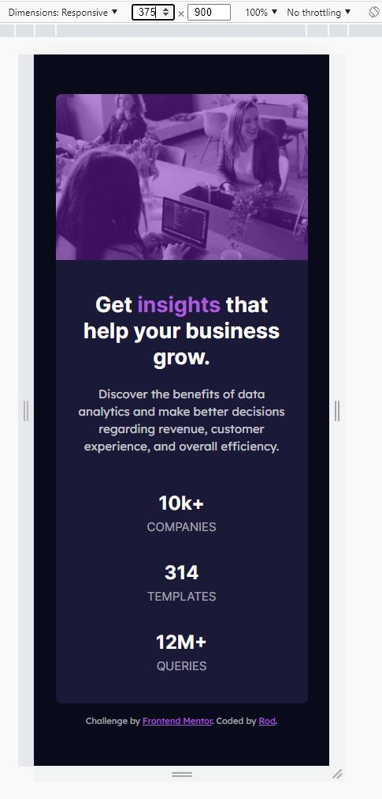
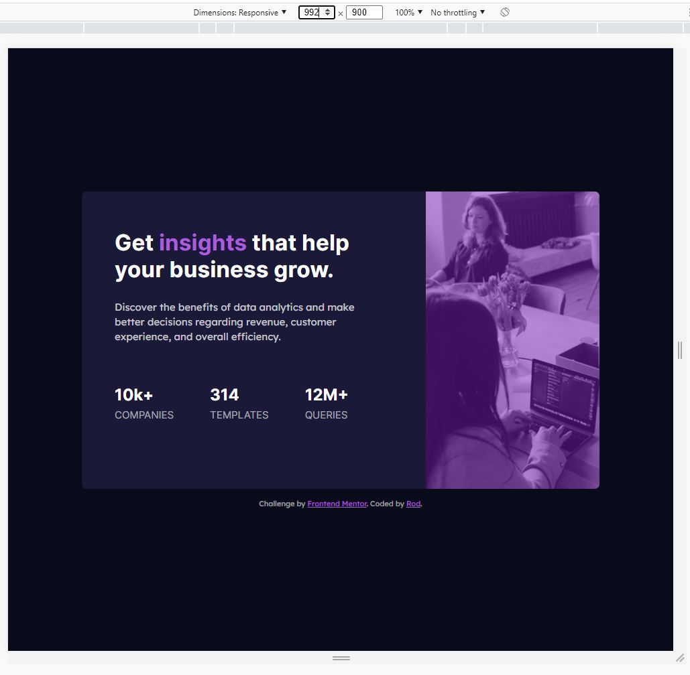
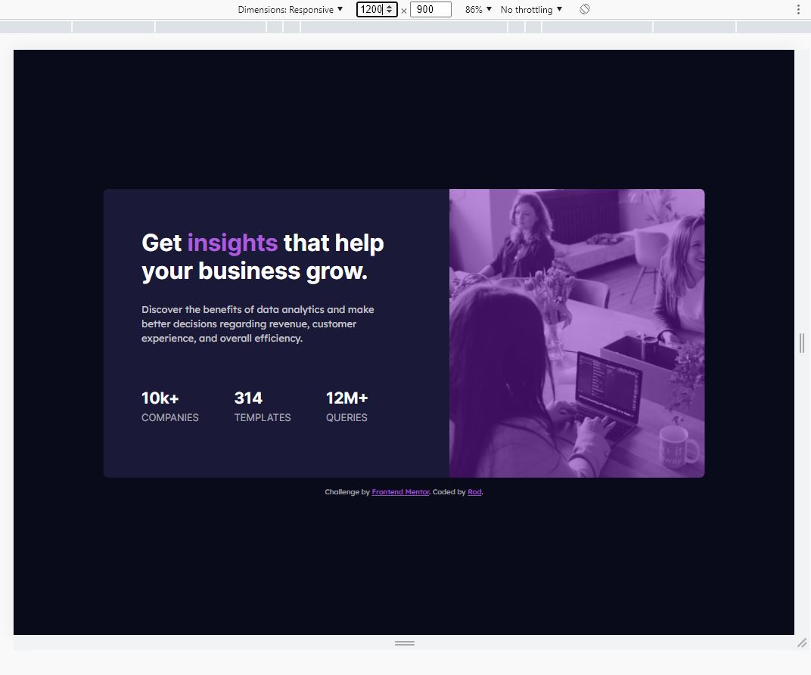
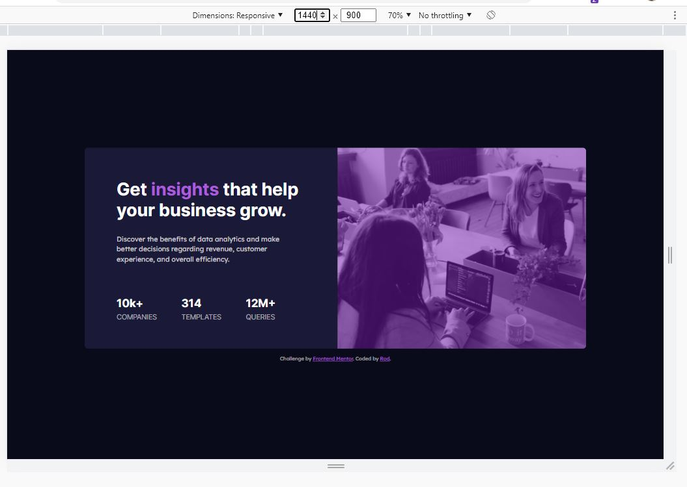

# Frontend Mentor - Stats preview card component solution

This is a solution to the [Stats preview card component challenge on Frontend Mentor](https://www.frontendmentor.io/challenges/stats-preview-card-component-8JqbgoU62). Frontend Mentor challenges help you improve your coding skills by building realistic projects.

## Table of contents

- [Overview](#overview)
  - [The challenge](#the-challenge)
  - [Screenshots](#screenshots)
  - [Links](#links)
- [My process](#my-process)
  - [Built with](#built-with)
  - [What I learned](#what-i-learned)
  - [Useful resources](#useful-resources)

## Overview

### The challenge

Users should be able to:

- View the optimal layout depending on their device's screen size

### Screenshots

\
\
\
\
\
\

### Links

- Live Site URL: [Live](https://bague-rodnel.github.io/stats-preview-card-component/)

## My process

### Built with

- Semantic HTML5 markup
- Sass
- Flexbox
- Mobile-first workflow

### What I learned

Sass is powerful.

Specificity issues can still occur. I'm currently adapting a style where the media queries are not nested. I am also target each element by including its ancestors to make sure it doesn't lose the specificity battle with any other declarations above it. I can afford it since I can make do with shorter classnames with sass' nested declarations over bem cuz I like my html clean. :)

### Useful resources

- [Sass](https://sass-lang.com/documentation) - Sass Documentation
